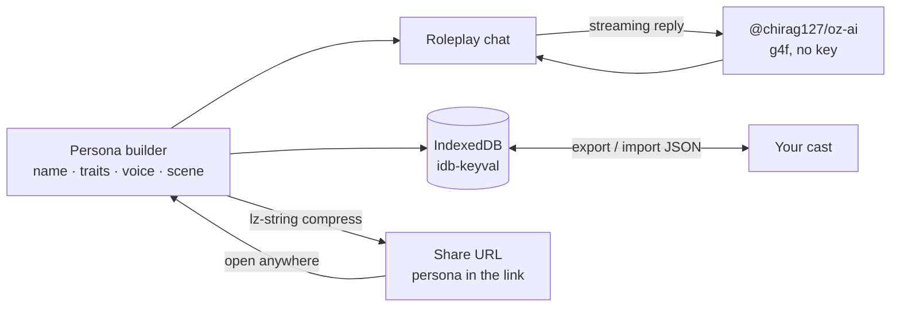

# oriz Persona

> AI character chat — create personas, roleplay, save and share via URL. 100% client-side.

[](./LICENSE)
[](https://github.com/chirag127/oriz-persona/stargazers)
[](https://github.com/chirag127/oriz-persona/commits/main)
[](https://astro.build)
[](https://persona.oriz.in)

- **Live app:** https://persona.oriz.in _(canonical — Cloudflare Pages)_
- **About / info:** https://chirag127.github.io/oriz-persona/ _(GitHub Pages landing)_
- **Repo:** https://github.com/chirag127/oriz-persona
- **llms.txt:** https://persona.oriz.in/llms.txt

AI character chat. Build a persona — name, traits, voice, opening line, scene — then roleplay with it in a bouncy speech-bubble chat. Save your cast in the browser, or share any character with a single link.

**100% client-side. No upload, no signup, no server. Free.** Your characters and conversations never leave your device. Share links carry the character itself (compressed into the URL), so nothing is stored anywhere.

**⭐ If this is useful, please [star the repo](https://github.com/chirag127/oriz-persona/stargazers) — it helps others find it.**

## How it works



## Features

- **Persona builder** — name, tagline, personality traits, voice/tone, opening greeting, scene, card colour.
- **Roleplay chat** — streaming, in-character replies via [`@chirag127/oz-ai`](https://github.com/chirag127/design-system) (wraps g4f/gpt4free, multi-provider failover, no API key). Stop/restart mid-chat.
- **Trading-card gallery** — every character is a holographic card. Starter characters included.
- **Save locally** — IndexedDB (`idb-keyval`). Export/import your whole cast as JSON.
- **Share by URL** — the persona is packed into the link with `lz-string`; open it anywhere to chat.
- **Graceful AI degradation** — if every provider is down, your characters and saved chats stay intact.

## Tech

Astro (static) · React 19 islands · Tailwind v4 · `@chirag127/oz-*` shared packages · `lz-string` · `idb-keyval`. PWA-installable. The AI lib is dynamically imported only when you send the first message, so first paint is instant.

## Develop

```bash
npm install --legacy-peer-deps
npm run dev      # local dev
npm test         # vitest — pure logic (persona prompt + share codec)
npm run build    # static build to dist/
npm run deploy   # build + wrangler pages deploy
```

> Windows: use **npm**, not pnpm (pnpm skips `@esbuild/win32-x64` and the build crashes).

## Privacy

No backend. No analytics. No cookies. AI requests go directly from your browser to g4f providers; everything else (characters, chats) is local-only.

## Part of the oriz family

One of ~80 small, fast, single-purpose tools and sites in the **oriz** fleet — see [blog.oriz.in](https://blog.oriz.in) for how it's built and run solo. Sibling tools: [muse.oriz.in](https://muse.oriz.in) · [quiz.oriz.in](https://quiz.oriz.in) · [name.oriz.in](https://name.oriz.in) · [json.oriz.in](https://json.oriz.in).

**Cost:** $0 — static build hosted free on Cloudflare Pages; AI is keyless (g4f) and client-side.

## Contributing

Issues and PRs welcome. Conventional commits are the changelog.

## Author

Chirag Singhal · chirag@oriz.in

## Status

Stable.

## License

MIT © 2026 Chirag Singhal
